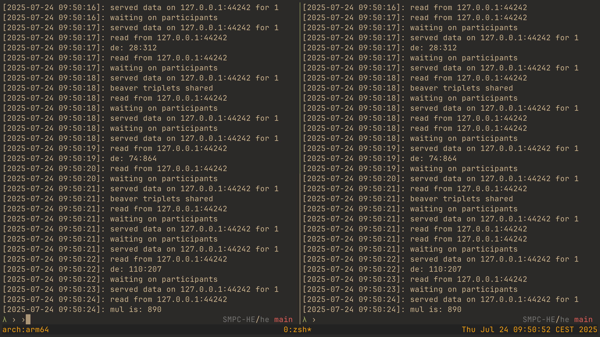

# Secure Two-Party Vector Product Using Paillier Cryptosystem

This implementation provides a secure two-party computation protocol for calculating the inner product of two private vectors using the Paillier cryptosystem and Beaver triples. The system consists of two parties (Alice and Bob) who wish to compute the product of their private vectors without revealing them to each other.



## Overview

The implementation includes four main components:

1. `alice.lua` - Alice's protocol implementation
2. `bob.lua` - Bob's protocol implementation
3. `pallier.lua` - Paillier cryptosystem implementation
4. `tools.lua` - Utility functions for mathematical operations

## Prerequisites
- Lua 5.4+

## Protocol Description

The protocol uses a combination of Paillier homomorphic encryption and Beaver triples to compute the inner product of two vectors securely. Here's how it works:

1. **Setup Phase**
   - Alice initializes the Paillier cryptosystem with prime numbers p and q
   - Alice shares the public parameters (n, g) with Bob
   - Both parties generate their private input vectors

2. **Computation Phase**
   For each vector component, the parties:
   - Generate Beaver triple shares (x, y, z)
   - Compute masked values d and e
   - Calculate partial products using homomorphic properties
   - Combine shares to get the final result

## Components

### Alice (alice.lua)

Alice acts as the primary party in the protocol:
- Initializes the Paillier cryptosystem
- Shares public parameters with Bob
- Generates and manages Beaver triple shares
- Performs encrypted computations
- Coordinates the final result calculation

Key functions:
- `setup()`: Initializes the system and shares parameters
- `beaver()`: Generates and shares Beaver triple components
- `de()`: Computes masked values d and e
- `addw()`: Adds partial products
- `mul()`: Combines shares for final result

### Bob (bob.lua)

Bob acts as the secondary party:
- Receives public parameters
- Participates in Beaver triple generation
- Performs complementary computations
- Contributes to the final result

Key functions:
- `setup()`: Initializes using Alice's parameters
- `beaver()`: Generates complementary Beaver shares
- `de()`: Computes complementary masked values
- `addw()`: Adds partial products
- `mul()`: Shares final contribution

### Paillier Cryptosystem (pallier.lua)

Implements the Paillier cryptosystem operations:
- Key generation
- Encryption
- Decryption
- Homomorphic operations

Key functions:
- `initalice(p, q)`: Initialize system for Alice
- `initbob(n, g)`: Initialize system for Bob
- `encrypt(m)`: Encrypt a message
- `decrypt(c)`: Decrypt a ciphertext

### Utilities (tools.lua)

Provides mathematical utility functions:
- `gcd()`: Greatest Common Divisor
- `lcm()`: Least Common Multiple
- `modularExp()`: Modular exponentiation
- `modInverse()`: Modular multiplicative inverse
- `genVec()`: Generate random vectors
- `formatVec()`: Format vectors for display

## Usage

1. Start Alice's protocol:
```bash
lua alice.lua [dimension]
```

2. Start Bob's protocol:
```bash
lua bob.lua
```

The dimension parameter (default: 3) determines the size of the vectors to be multiplied.

## Security Features

- Uses Paillier's homomorphic encryption for secure computation
- Implements Beaver triples for secure multiplication
- Maintains privacy of input vectors
- Reveals only the final product

## Network Communication

The implementation uses a simple IPC mechanism:
- Default port: 44242
- Default IP: 127.0.0.1 (localhost)
- Implements retry mechanism for reliability

## Mathematical Background

The implementation relies on several cryptographic and mathematical concepts:

1. **Paillier Cryptosystem Properties**:
   - Additive homomorphic encryption
   - Multiplication by constant
   - Modular arithmetic operations

2. **Beaver Triples**:
   - Used for secure multiplication
   - Parties share random values (x, y, z) where z = xy

## Implementation Notes

- Uses Lua programming language
- Requires mathematical precision for large numbers
- Implements error handling and retry mechanisms
- Provides testing functions for cryptographic operations

## Limitations

- Uses basic network communication
- Synchronous protocol execution
- Limited error handling

## Testing

The Paillier implementation includes test functions:
- Basic encryption/decryption
- Homomorphic addition
- Homomorphic multiplication by constant

Run tests using:
```lua
local pallier = require("pallier")
pallier:test()
```
